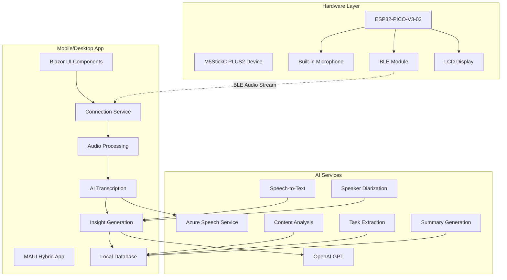
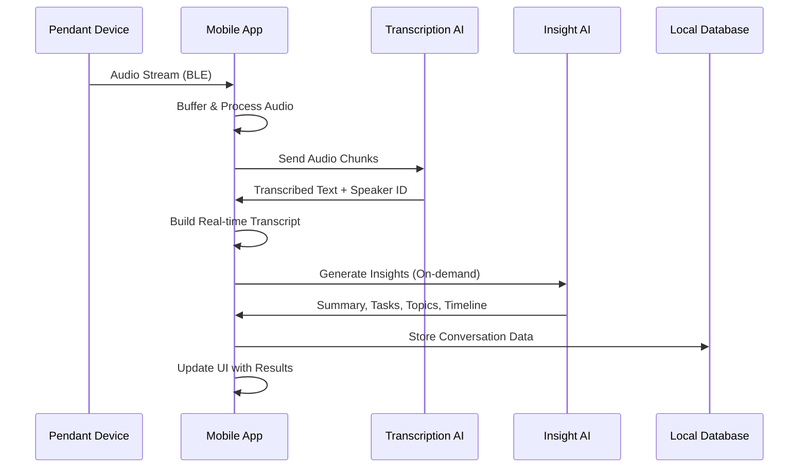
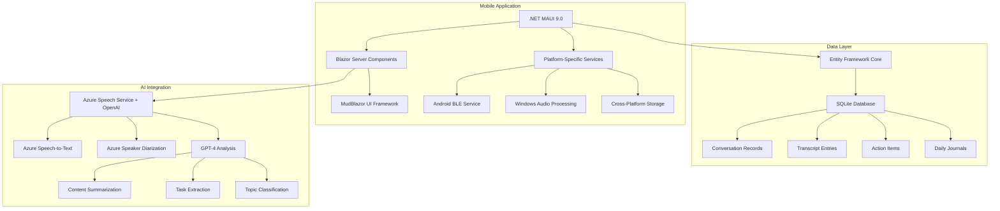
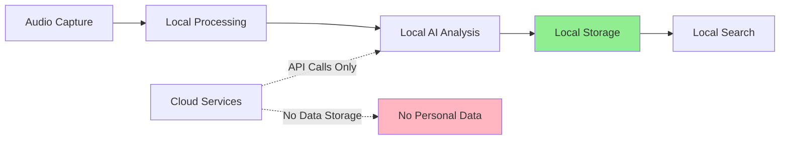

# ConverSense - Smart Audio Companion for Intelligent Conversation Management

> Transform every conversation into actionable insights with AI-powered audio analysis and real-time transcription

## 🎯 Problem Statement

In our fast-paced world, we have countless important conversations daily - meetings, brainstorming sessions, interviews, and casual discussions that contain valuable information, decisions, and action items. However, most of this valuable content is lost due to:

- **Information Overload**: Too many conversations to remember or process effectively
- **Manual Note-Taking**: Time-consuming and error-prone note-taking during conversations
- **Lost Context**: Important details, decisions, and action items get forgotten over time
- **Inefficient Follow-ups**: Difficulty tracking commitments and tasks mentioned in conversations
- **Lack of Searchability**: No way to search through past conversations for specific information
- **Missed Insights**: Unable to identify patterns and themes across multiple conversations

ConverSense solves these problems by providing an intelligent, wearable solution that automatically captures, processes, and analyzes your conversations in real-time.

## 🏗️ System Architecture



## 💡 How It Works

ConverSense consists of two main components working in perfect harmony:

### 1. Smart Pendant Device
- **Hardware**: M5StickC PLUS2 with ESP32-PICO-V3-02 processor
- **Audio Capture**: High-quality 16kHz audio recording
- **Connectivity**: Bluetooth Low Energy (BLE) for seamless phone pairing
- **Interface**: Minimal LCD display showing recording status and connection state

### 2. Cross-Platform Mobile/Desktop App
- **Technology**: .NET MAUI Hybrid with Blazor components
- **Real-time Processing**: Live audio streaming and transcription
- **AI Integration**: Azure Speech Service for transcription and diarization, GPT for insights
- **Local Storage**: SQLite database for privacy and offline access
- **Cross-platform**: Runs on Android and Windows

## 🔄 Data Flow & Processing Pipeline



## ✨ Key Features & Benefits

### 🎤 **Seamless Audio Capture**
- Hands-free recording with wearable pendant device
- High-quality 16kHz audio capture optimized for speech
- Automatic noise filtering and audio enhancement
- Real-time audio streaming via BLE connection

### 🤖 **AI-Powered Intelligence**
- **Real-time Transcription**: Convert speech to text with Azure Speech Service
- **Speaker Diarization**: Advanced speaker identification and separation
- **Smart Summarization**: Generate concise summaries of key discussion points
- **Automatic Task Extraction**: Identify and track action items and commitments
- **Topic Analysis**: Extract and categorize main themes and subjects
- **Timeline Generation**: Create chronological event timelines for long conversations

### 📊 **Comprehensive Insights**
- Daily conversation overviews and patterns
- Searchable conversation archive
- Task management and follow-up tracking
- Speaker analytics and participation metrics
- Conversation quality and engagement analysis

### 🔒 **Privacy & Security**
- **No Cloud Dependencies**: Conversations stored locally on your device
- **Recording Indicator**: Visual cue when recording is active


### 🌐 **Cross-Platform Compatibility**
- Native mobile apps for Android and iOS
- Desktop applications for Windows
- Synchronized data across all your devices
- Responsive web-based interface

## 📱 Application Screenshots

### Pendant Device Interface
<div style="display: flex; gap: 10px; flex-wrap: wrap;">
  
  
  
</div>

### Mobile Application Interface

#### Main Recording & Control
<div style="display: flex; gap: 10px; flex-wrap: wrap;">
  
  
  
</div>

#### Conversation Analysis & Insights
<div style="display: flex; gap: 10px; flex-wrap: wrap;">
  
  
  
  
</div>

#### Timeline & Task Management
<div style="display: flex; gap: 10px; flex-wrap: wrap;">
  
  
  
</div>

#### Daily Journal & Insights
<div style="display: flex; gap: 10px; flex-wrap: wrap;">
  
  
  
</div>

#### Search & History
<div style="display: flex; gap: 10px; flex-wrap: wrap;">
  
  
</div>

## 🛠️ Technical Implementation

### Hardware Architecture
- **Microcontroller**: ESP32-PICO-V3-02 (240MHz dual-core, 520KB SRAM)
- **Audio Sampling**: 16kHz, 16-bit, mono channel recording
- **Connectivity**: Bluetooth Low Energy 5.0 with custom audio streaming protocol
- **Display**: 1.14" TFT LCD (135x240 pixels) for status indication
- **Power Management**: Optimized for extended battery life with sleep modes
- **Audio Buffer**: 5-chunk circular buffer with FreeRTOS stream management

### Software Stack



### Key Components

#### 🎯 **Orchestration Service**
Central coordinator managing the application lifecycle:
- Device connection management
- Audio stream processing coordination
- Real-time transcription orchestration
- AI insight generation scheduling
- State management across UI components

#### 🔊 **Audio Processing Pipeline**
- **Capture**: 16kHz audio sampling from pendant device
- **Buffering**: Multi-chunk circular buffer for smooth streaming
- **Transmission**: BLE packet optimization for audio data
- **Processing**: Real-time audio enhancement and noise reduction

#### 🤖 **AI Integration Services**
- **Transcription Service**: Azure Speech Service integration with real-time processing
- **Speaker Diarization**: Advanced speaker identification and conversation turn detection
- **Insight Service**: GPT-4 powered conversation analysis
- **Content Analysis**: Smart extraction of topics, tasks, and summaries

## 💼 Business Benefits

### For Professionals
- **Meeting Efficiency**: Never miss important decisions or action items
- **Client Relations**: Better follow-up on client conversations and commitments
- **Knowledge Management**: Build a searchable knowledge base of professional interactions
- **Performance Tracking**: Analyze communication patterns and effectiveness

### For Teams
- **Collaboration**: Share conversation insights and action items seamlessly
- **Accountability**: Track commitments and follow-through across team members
- **Documentation**: Automatic meeting minutes and decision logs
- **Process Improvement**: Identify communication bottlenecks and opportunities

### For Personal Use
- **Memory Enhancement**: Never forget important personal conversations
- **Relationship Building**: Track meaningful interactions with friends and family
- **Learning**: Review and reflect on educational or mentoring conversations
- **Goal Tracking**: Monitor progress on personal development discussions

## 🔐 Privacy & Data Protection

### Local-First Architecture


- **Zero Cloud Storage**: All conversation data remains on your device
- **Selective AI Processing**: Only processed audio chunks sent to Azure Speech Service for transcription


## 🏗️ Development & Architecture

### Project Structure
```
SmartPendant/
├── SmartPendant.Embedded/          # ESP32 firmware
│   ├── src/main.cpp               # Main application logic
│   ├── platformio.ini             # Build configuration
│   └── lib/                       # Dependencies
├── SmartPendant.MAUIHybrid/       # Cross-platform app
│   ├── Components/                # Blazor UI components
│   ├── Services/                  # Core business logic
│   ├── Data/                      # Database entities
│   ├── Abstractions/              # Service interfaces
│   └── Platforms/                 # Platform-specific code
└── Resources/                     # Documentation assets
```

### Technology Stack
- **Embedded**: C++ with ESP-IDF and Arduino framework
- **Mobile**: .NET MAUI 9.0 with Blazor Server components
- **UI Framework**: MudBlazor for Material Design components
- **Database**: SQLite with Entity Framework Core
- **AI Integration**: 
  - Azure Speech Service for transcription and speaker diarization
  - OpenAI GPT-4 for conversation analysis and insights
- **Communication**: Bluetooth Low Energy (BLE)

## 🌟 Future Roadmap

### Planned Features
- **Map View**: Location based transcription and analysis
- **Multi-language Support**: Transcription and analysis in 50+ languages
- **Audio Memories**: Like photos, users can save and revisit important audio snippets (like on this day...)
- **Smart Notifications**: Proactive reminders for action items


## 📄 License

This project is licensed under the MIT License - see the [LICENSE](./LICENSE) file for details.

## 🙏 Acknowledgments

- **M5Stack** for the excellent M5StickC PLUS2 hardware platform
- **Microsoft Azure** for providing robust Speech Service with advanced diarization capabilities
- **OpenAI** for providing powerful AI APIs for conversation analysis and insights
- **Microsoft** for the .NET MAUI framework enabling cross-platform development
- **MudBlazor** community for the beautiful UI component library

---

**Built with ❤️ for better conversations and smarter insights**

